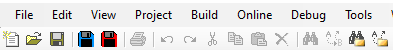

# Workflow automation scripts for CODESYS

Collection of scripts meant for Codesys that automate workflow inside of the IDE.

## Available scripts

### Save project and export to xml

This script will save your active project and export all of its objects in wanted format. Supported formats are PLC Open Xml and Codesys native Xml. The resulting file will be exported to the same folder the active project is located. This script must be run from CODESYS by its script engine.
In order to select the wanted xml format following arguments can be passed to the script:

- '-p' or '--plcopenxml' for PLC Open Xml

- '-n' or '--nativexml'  for Codesys Native Xml

## Installation

Quick installation guide:

- Create the Script Commands folder in one of the storage locations. I recommend C:\ProgramData\CODESYS\Script Commands

- Copy the Python, config.json and the .ico files there.

- Start CODESYS. The script files, configuration file, and symbol files are read and provided in the Tools -> Customize dialog in the Command Icons tab, ScriptEngine Commands category. Add the scripts to wanted shortcuts

More on codesys scripting on [Codesys Online Help](https://help.codesys.com/webapp/_cds_struct_using_scripts;product=codesys;version=3.5.16.0)

## License

MIT

## Contribution

Raise a pull request
 
